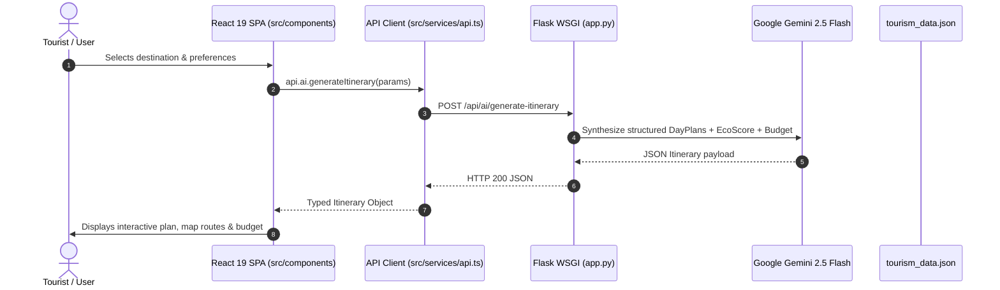

# 🏛️ TourMaster AI - Repository Architecture & Codebase Map

> **Smart India Hackathon 2026 | Problem Statement: 26204 | Team NEXUS**  
> A clean, modular, and production-ready architectural guide for the **TourMaster** ecosystem.

---

## 🧭 Visual Repository Layout

```
tourmaster/
│
├── 🎨 FRONTEND COLLECTION (React 19 + TypeScript + Vite + TailwindCSS 4)
│   ├── src/
│   │   ├── components/                     # Component Library organized by domains
│   │   │   ├── TouristHub/                 # Tourist Experience Modules
│   │   │   │   ├── TouristDiscoveryHub.tsx             # Interactive Spot & City Explorer
│   │   │   │   ├── TouristFacilityBookingSection.tsx   # Stays, Food, Taxis, Guides Booking
│   │   │   │   ├── InteractiveGeoMap.tsx               # Leaflet GIS Mapping Engine
│   │   │   │   ├── AIItineraryPlanView.tsx             # Dynamic AI Schedule & Budget Visualizer
│   │   │   │   ├── AITourGuideAssistant.tsx            # Multilingual Gemini Concierge Chat
│   │   │   │   ├── EmergencySOSModal.tsx               # One-Tap SOS Distress Dispatcher
│   │   │   │   ├── LiveDeviceWeatherBanner.tsx         # Weather Alert & Adaptation Banner
│   │   │   │   ├── BookingCheckoutModal.tsx            # Unified Checkout & Payment Simulator
│   │   │   │   └── TouristBookingsActivityDrawer.tsx   # Live Itinerary & Bookings Tracker
│   │   │   ├── ProviderPortal/             # Business & Service Provider Experience
│   │   │   │   └── ProviderDashboard.tsx               # Provider Onboarding, Listings & Verification
│   │   │   ├── AdminPortal/                # Tourism Board & Emergency Ops Center
│   │   │   │   └── AdminDashboard.tsx                  # Live SOS Radar, Crowd Heatmaps & Moderation
│   │   │   ├── SIHArchitectureExplorer/    # Hackathon Evaluation Suite
│   │   │   │   └── SIHArchitectureExplorer.tsx         # SIH Rubric, API Inspector & System Health
│   │   │   ├── AuthLandingGate.tsx         # Unified Role-Based Access Gate
│   │   │   ├── AuthModal.tsx               # Firebase Auth Modal
│   │   │   ├── HeaderNavbar.tsx            # Dynamic Glassmorphic Navigation Bar
│   │   │   └── LocationAccessPrompt.tsx    # Geolocation Permission Handler
│   │   ├── hooks/                          # Custom React State & Sensory Hooks
│   │   │   └── useLocationManager.ts       # Live GPS, Weather & IP-Geolocation Orchestrator
│   │   ├── data/                           # Master Datasets & Mock Fallbacks
│   │   │   ├── tourism_data.json           # Canonical JSON Master Database
│   │   │   └── mockTourismData.ts          # Static TypeScript Mock Fallback Dataset
│   │   ├── types.ts                        # Master TypeScript Domain Types & Interfaces
│   │   ├── firebase.ts                     # Firebase Auth & Firestore Client
│   │   ├── index.css                       # Global TailwindCSS & Theme Tokens
│   │   ├── App.tsx                         # Core Application Router & State Container
│   │   └── main.tsx                        # React DOM Root Entry Point
│   ├── public/                             # Public static assets, icons, and maps
│   ├── index.html                          # Single Page Application HTML5 Shell
│   └── vite.config.ts                      # Vite build pipeline & reverse proxy
│
├── ⚙️ BACKEND COLLECTION (Python Flask & FastAPI)
│   ├── app.py                              # Primary Production Flask WSGI Server (Gunicorn)
│   │   ├── Tourism Data REST Endpoints     # /api/spots, /api/hotels, /api/taxis, /api/guides
│   │   ├── Gemini Generative AI Engine     # /api/ai/generate-itinerary, /api/ai/tour-guide
│   │   ├── SOS Emergency Patrol Dispatch   # /api/sos, /api/sos/<id>
│   │   ├── Commerce & Booking Engine       # /api/bookings, /api/bookings/<id>
│   │   ├── Live Weather & Geocoding API    # /api/weather/live, /api/location/ip-detect
│   │   └── Production SPA Static Server    # Fallback to dist/index.html
│   ├── main.py                             # Secondary FastAPI ASGI Server Alternative
│   └── requirements.txt                    # Python Production Dependencies (Flask, Gunicorn, CORS)
│
├── 🔌 API & CONNECTIVES LAYER (Single Source of Truth)
│   └── src/services/
│       ├── api.ts                          # Type-Safe Centralized API Client (tourismApi, aiApi, etc.)
│       └── index.ts                        # Service Layer Barrel Export
│
├── 🚀 CLOUD DEPLOYMENT & DEVOPS
│   ├── render.yaml                         # Render Infrastructure-as-Code Blueprint
│   ├── build.sh                            # Production Build Pipeline (Pip + NPM + Vite)
│   ├── Dockerfile                          # Multi-Stage Container Definition
│   ├── .dockerignore                       # Docker Build Context Exclusions
│   ├── .gitignore                          # Clean Git Tracking Rules
│   ├── tsconfig.json                       # TypeScript Compilation Settings
│   └── package.json                        # Node.js Workspace Manifest & Scripts
│
└── 📚 DOCUMENTATION
    ├── README.md                           # Project Overview, Badges & Quickstart
    ├── ARCHITECTURE.md                     # Structural Codebase Specification (This file)
    └── DEPLOYMENT.md                       # Comprehensive Cloud Deployment Runbook
```

---

## 🧩 Architectural Domains

### 1. Frontend Collection (`/src`)
- **Presentation Layer**: Built on React 19, Lucide React icons, Motion animations, and TailwindCSS 4.
- **State Flow**: Unidirectional state lifting within `App.tsx` feeding down into role-based portals (`tourist`, `provider`, `admin`, `sih-explorer`).
- **Geo-Visualization**: Custom Leaflet dynamic tile renderer with custom marker icons for heritage spots, verified hotels, dining, and live distress alerts.

### 2. Backend Collection (`/app.py` & `/main.py`)
- **Python Flask (`app.py`)**: Production WSGI entry point loaded by Gunicorn (`2 workers, 4 threads`). Serves both REST API endpoints and static SPA bundles.
- **AI Engine**: Direct integration with **Google Gemini 2.5 Flash** for dynamic, budget-bounded itinerary synthesis, weather adaptation, and conversational travel guides.
- **FastAPI Alternative (`main.py`)**: High-performance ASGI alternative for async high-concurrency benchmarks.

### 3. Centralized API & Connectives (`src/services/api.ts`)
Unified, typed connector wrapping all endpoints:
```typescript
import { api } from './services/api';

// Example: Fetch spots
const spots = await api.tourism.getSpots('Pune', 'Heritage');

// Example: Generate AI Itinerary
const itinerary = await api.ai.generateItinerary(userPreferences);

// Example: Trigger SOS Alert
const alert = await api.sos.triggerSOS({ touristName, touristPhone, lat, lng });
```

---

## 🔄 Data & Request Flow


