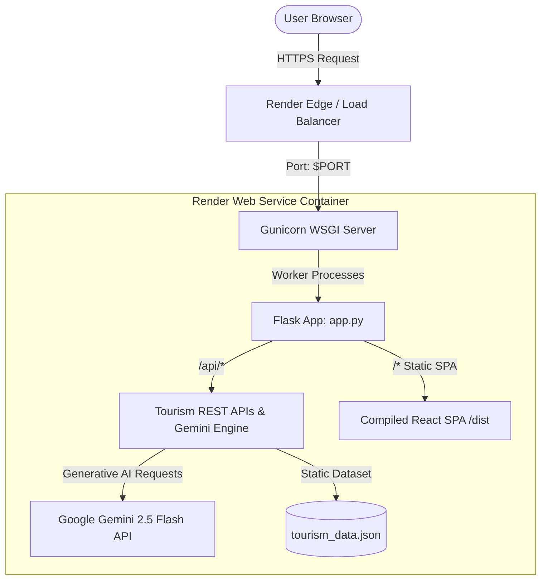

# 🚀 TourMaster Production Deployment Guide on Render

This guide provides step-by-step instructions to deploy the **TourMaster** AI Tourism Platform to [Render](https://render.com) for production.

---

## 🏗 Architecture Overview



- **Frontend**: React 19 + TypeScript + Vite + TailwindCSS 4 compiled into optimized static assets in `/dist`.
- **Backend**: Python 3.11 Flask server running behind multi-threaded **Gunicorn** WSGI workers.
- **Unified Port**: Single web service hosting both the REST API endpoints (`/api/*`) and the React SPA fallback (`/*`).

---

## ⚡ Option 1: 1-Click Render Blueprint Deployment (Recommended)

Render Blueprints use Infrastructure-as-Code to automatically configure the build commands, environment variables, health checks, and start commands defined in [`render.yaml`](./render.yaml).

### Steps:
1. **Push your code** to GitHub:
   ```bash
   git add .
   git commit -m "feat: add Render production deployment configuration"
   git push origin main
   ```
2. Log in to [Render Dashboard](https://dashboard.render.com).
3. Click **New +** in the top navigation and select **Blueprint**.
4. Connect your GitHub account and select the **`Ethicalvedant/tourmaster`** repository.
5. Render will automatically detect `render.yaml`.
6. Enter your `GEMINI_API_KEY` in the environment variable prompt.
7. Click **Apply**. Render will automatically:
   - Provision a Python 3.11 web service.
   - Run `./build.sh` (installing Python packages, installing npm packages, and building the Vite frontend).
   - Start the app with `gunicorn app:app --bind 0.0.0.0:$PORT --workers 2 --threads 4`.
   - Perform health checks on `/api/health`.

---

## 🛠 Option 2: Manual Web Service Setup on Render

If you prefer to configure the service manually via the Render UI:

1. In the Render Dashboard, click **New +** → **Web Service**.
2. Connect your repository: `https://github.com/Ethicalvedant/tourmaster`.
3. Fill in the service configuration details:

| Setting | Value |
| :--- | :--- |
| **Name** | `tourmaster` (or your preferred name) |
| **Region** | `Oregon (US West)` or `Frankfurt (EU)` |
| **Branch** | `main` |
| **Root Directory** | *(leave blank)* |
| **Runtime** | `Python 3` |
| **Build Command** | `./build.sh` *(or `pip install -r requirements.txt && npm install && npm run build`)* |
| **Start Command** | `gunicorn app:app --bind 0.0.0.0:$PORT --workers 2 --threads 4 --timeout 120` |
| **Instance Type** | `Free` (or Starter for higher traffic) |

4. Scroll down to **Environment Variables** and add:

| Key | Value | Notes |
| :--- | :--- | :--- |
| `GEMINI_API_KEY` | `AIzaSy...` | Get your key from [Google AI Studio](https://aistudio.google.com/app/apikey) |
| `PYTHON_VERSION` | `3.11.9` | Ensures Python 3.11 runtime |
| `NODE_VERSION` | `20.18.0` | Ensures Node.js 20+ runtime for Vite build |
| `FLASK_ENV` | `production` | Production mode |
| `FLASK_DEBUG` | `0` | Disable debug mode |

5. Under **Advanced** settings:
   - **Health Check Path**: `/api/health`
   - **Auto-Deploy**: `Yes`
6. Click **Create Web Service**.

---

## 🐳 Option 3: Docker Deployment on Render

If you prefer containerized deployment, Render also supports Docker runtimes using the included [`Dockerfile`](./Dockerfile):

1. Click **New +** → **Web Service**.
2. Choose your repository.
3. Select **Docker** as the Runtime.
4. Render will automatically build the multi-stage Docker image and start the container on `$PORT`.
5. Add `GEMINI_API_KEY` to the Environment Variables.

---

## 🔍 Verification & Health Check

Once deployment is complete, test the following:

1. **Health Check API**:
   ```bash
   curl https://<your-app-name>.onrender.com/api/health
   ```
   **Expected Response:**
   ```json
   {
     "app": "TOURMASTER AI (Python Flask)",
     "status": "ok",
     "hasGeminiKey": true,
     "hackathon": "Smart India Hackathon 2026",
     "problemStatement": "26204",
     "team": "NEXUS"
   }
   ```

2. **Frontend UI**:
   Open `https://<your-app-name>.onrender.com` in your browser. The full TourMaster dashboard, interactive maps, AI itinerary generator, and emergency SOS systems will load immediately.

---

## 🌐 Custom Domains & SSL

1. In Render Dashboard, open your web service and navigate to **Settings** → **Custom Domains**.
2. Add your domain (e.g., `tourmaster.yourdomain.com`).
3. Add the CNAME / ALIAS DNS records provided by Render to your DNS provider (Cloudflare, GoDaddy, Namecheap).
4. Render will automatically provision and renew a free Let's Encrypt SSL certificate.

---

## ❓ Troubleshooting

| Issue | Cause | Solution |
| :--- | :--- | :--- |
| `GEMINI_API_KEY is not configured` | Missing environment variable | Add `GEMINI_API_KEY` in Render Service Settings → Environment. |
| `build.sh: permission denied` | Execution permissions missing | Run `git update-index --chmod=+x build.sh` and push. |
| White screen on frontend load | Vite assets not built | Verify that `npm run build` executed and generated `/dist`. |
| Render Free tier cold start latency | Free instances spin down after 15 min inactivity | Upgrade to Starter tier ($7/mo) or use a periodic ping tool like UptimeRobot on `/api/health`. |
